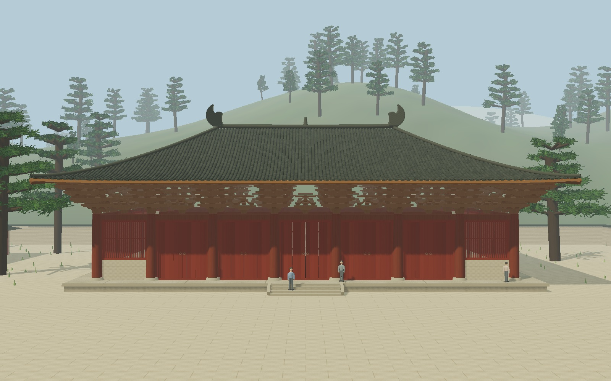
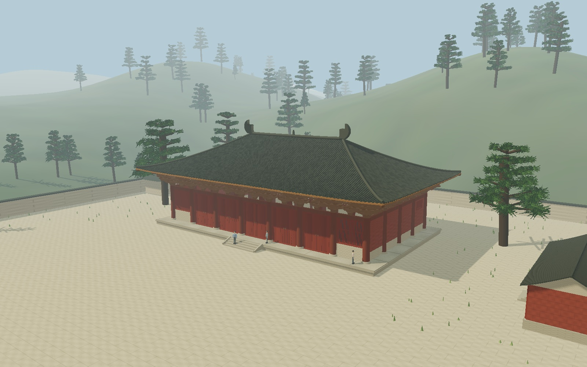
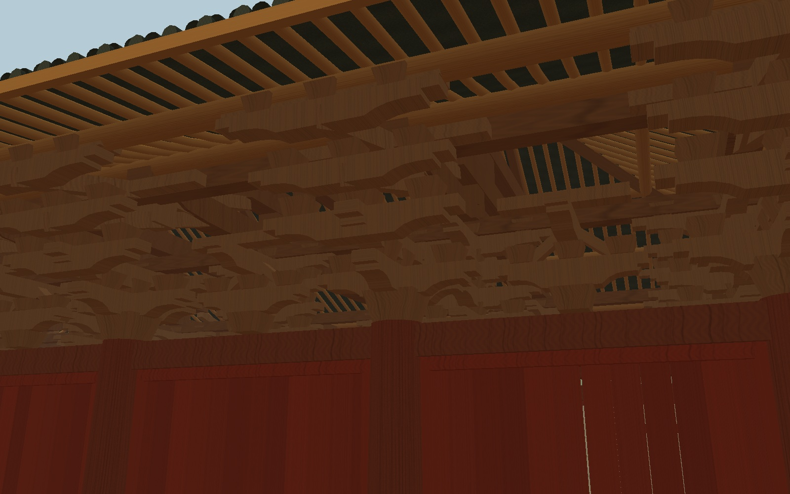
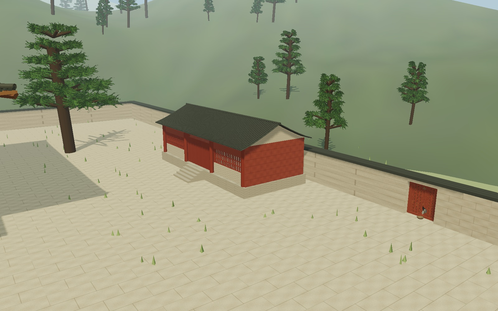
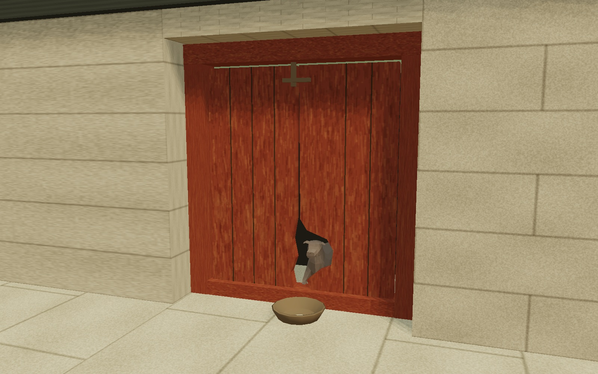

# 三批参考资料对应的增量校正

2026-09-28。基于既有发布版本 `db53a900de88e85019aeac24ac58bed64a178ab0` 修改；没有重建项目。UI 布局、CSS、相机控制框架、爆炸动画引擎、37 秒演示框架、Pages 工作流均保留。

## 本体与尺度

参考优先级为用户提供的平立剖及结构图，其次为现场照片，再次为示意渲染；截图不清楚的尺寸不作为精确测绘值。下列数值是统一建模基准，单位约定为米，并非文物修缮依据。

| 位置 / 参数 | 上一版 | 本次 |
| --- | --- | --- |
| 前面柱轴总宽 | 34.00 | 34.15 |
| 七间柱距 | 4.7 / 4.8 / 4.9 / 5.2 / 4.9 / 4.8 / 4.7 | 4.45 / 5.05 / 5.05 / 5.05 / 5.05 / 5.05 / 4.45 |
| 正面门窗 | 中间 3 间门、较多格栅 | 中间 5 间双扇板门、两尽间直棂窗和槛墙 |
| 建筑进深柱轴 | 17.70 | 17.66，仍为四间 |
| 内外柱位 | 36 | 保留 22 外柱 + 14 内柱并同步轴线 |
| 台面高度 | 2.15 | 0.72，简朴低台基；4 级实体踏步 |
| 柱顶标高 | 7.55 | 6.15；柱础及木柱底部同步调整 |
| 正脊长度 | 22.60 | 16.80，更接近参考正立面长短关系 |
| 屋面外轮廓 | 42.70 × 25.60 | 41.70 × 25.32 |
| 脊部曲面标高 | 14.30 | 13.95，不含脊饰高度 |
| 檐部曲面基本标高 | 9.28 | 8.80 |
| 前后出檐（柱轴至瓦口） | 3.95 | 3.83，仍是深远出檐 |

主体木构、台基、门窗、瓦口分别使用统一配置，避免只缩放屋顶却留下旧柱网。屋面仍为四片连续参数曲面；收敛檐角反曲，未改为明清式高翘角。瓦垄和椽沿固定平面轴线铺设，在垂脊处收止，改正了旧版向脊端扇形聚拢的关系。

## 斗拱和梁架

- 柱头：较大的栌斗、两跳华栱、两层下昂、横向栱与承托斗、上层枋，以及向殿内延伸的昂尾。
- 补间：较浅的出跳和较简的承托组合，与柱头七铺作近似样板区别开。
- 转角：共享柱头大斗，两个正交方向加一个斜向承托；角部昂尾降低以避让四坡屋面。
- 内槽：表现梁架下的层层承托，不照搬外檐昂嘴。
- 栱不再是单纯直方块；采用少分段的卷杀 / 阶梯形截面。四种样板合并后重复实例化，斗拱共 13 个渲染批次。
- 增加月梁形下缘、乳栿与内外槽联系，草架和成对叉手支承脊檩；中间四榀到达脊部，两端梁架在庑殿斜坡下收短。
- 檩条、角部承托和椽按同一屋面函数匹配；避免主梁、昂尾从瓦面穿出。

木构分层与原有爆炸注册同步，结构模式和普通模式使用同一组几何。没有另存一套旧的“爆炸模型”。重组由每组初始 Transform 计算，不累计位移。没有建立佛像、塑像、佛坛或高精度隐藏榫卯。

## 院落、人物和二亮

坐标约定：殿前为 +Z，面向主殿时的画面右侧为 +X；院落仅对应用户圈定的相对位置，不声称为全寺院测绘。

- 右侧小建筑中心约 `(38.35, 0, 6.5)`，靠右院墙内侧，朝向院落；灰瓦双坡顶、红褐木立面、砖石基座、简易格栅及正面石阶。原来偏后的右侧建筑已移除，左侧远景轮廓保留。
- 围墙门中心约 `(43, 0, 24)`，在小建筑前方旁侧的院墙段。不是小建筑正门，也没有把门贴在建筑侧墙上。
- 门为两扇旧红木门，中央下部的不规则洞用真正的凹口挤出几何形成；院墙也分段给门让出开口。洞后为暗空间，门前放一只小碗。
- 狗使用 Quaternius 的 2017 OpenGameArt CC0 版 `Dog.obj`，约 29 KB、少于 1,000 个三角形，同源托管。做归一化、克制毛色和整体平移 / 轻转头，身体大部分在门后。29 秒周期中约 18 秒不出现，其余为缓慢进入、短暂停留和退回；远离门时不绘制。
- 人物为 3 位低面数尺度参照，身高约 1.65–1.78 米；位于前平台与台阶，衣色低饱和。脚底跟随实体台阶高度；爆炸展开时暂时隐藏，避免台基离开后人物悬空。

狗模型来源与许可证见 `public/models/LICENSE-erliang.txt`。没有将用户上传的截图、书页和现场照片作为纹理或网站资源重新发布。

## 性能和验证边界

完整场景含天空和狗统计：127 个 Mesh / InstancedMesh 对象、29,240 个实例或普通构件、552,960 个三角形。相比前版记录约 68.5 万三角形减少约 19%；增加了少量场景批次，但斗拱用合并样板实例化，椽和瓦使用低面数重复几何。Draw Calls 还受阴影、透明和后处理影响，不能用网格数直接替代。

保留 DPR 上限、自适应降级、共享材质、静态几何合并、原相机与响应式布局。模型相关 12 项新检查、18 项交互逻辑、50 轮基准组重组与 20 轮实际建筑重组通过。实际检查了正面、45°、檐下、结构、爆炸、院落和狗洞的离屏视图。离屏渲染不是浏览器截图，最终 WebGL 光照、透明排序和手机帧率尚未在可用真实设备上验证；详见 `VALIDATION.md`。

## 离屏检查图

图像来自当前实际 Three.js 几何和程序化材质，以原生 EGL / Mesa 绘制；用于形体核对，不代表最终浏览器光照及 UI。

